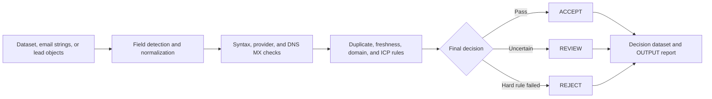

**Live Actor and maintained API: [Run B2B Lead Cleaner on Apify](https://apify.com/kamerozkan/b2b-lead-cleaner)**

# B2B Lead Cleaner: Domain-Level Email and MX Validation Samples

[](https://apify.com/kamerozkan/b2b-lead-cleaner)
[](dataset_record.schema.json)
[](#truth-boundary)
[](LICENSE)

Real public Task inputs, PII-safe run outputs, and a strict JSON Schema for routing B2B lead rows into `ACCEPT`, `REVIEW`, or `REJECT`.

The Actor checks email syntax, provider type, DNS mail routing, company-domain consistency, duplicates, freshness, and optional ICP rules. It keeps one explained output decision per delivered source row.

## Measured public examples

These results came from successful public Task runs on 2026-07-28 using Actor build `0.0.29`. The dataset contract was checked against the current `0.0.30` Actor source.

| Public Task | Actual run result | Input |
| --- | --- | --- |
| [Audit Purchased B2B Leads Before Vendor Renewal](https://apify.com/kamerozkan/b2b-lead-cleaner/examples/audit-purchased-b2b-leads-before-vendor-renewal) | 7 delivered: 5 ACCEPT, 1 REVIEW, 1 REJECT. A supplied $70 audited-scope cost produced a reported $14 per accepted lead. | [JSON](01_audit_purchased_b2b_leads_before_vendor_renewal_input.json) |
| [Clean a B2B Lead List Before Cold Outreach](https://apify.com/kamerozkan/b2b-lead-cleaner/examples/clean-a-b2b-lead-list-before-cold-outreach) | 7 delivered: 5 ACCEPT, 1 role-inbox REVIEW, 1 duplicate REJECT. | [JSON](02_clean_a_b2b_lead_list_before_cold_outreach_input.json) |
| [Prepare Complete B2B Leads for CRM Import](https://apify.com/kamerozkan/b2b-lead-cleaner/examples/prepare-complete-b2b-leads-for-crm-import) | 5 delivered: 5 ACCEPT with score 100 in this synthetic sample. | [JSON](03_prepare_complete_b2b_leads_for_crm_import_input.json) |

## Why use a decision pipeline?

| Need | Raw-list handling | This Actor |
| --- | --- | --- |
| Routing | Manual judgment or one opaque score | Explained `ACCEPT`, `REVIEW`, or `REJECT` |
| Email evidence | Often just a non-empty string | Syntax, provider class, and DNS MX evidence |
| Duplicates | Rows may be silently removed | Every delivered row remains, with duplicate flags and reason codes |
| Source formats | Fixed column names | Common aliases, nested paths, and manual field mapping |
| Targeting | Separate spreadsheet filters | Optional country, city, title, industry, and account rules |
| Run audit | Row output only | Dataset decisions plus an `OUTPUT` run report |

## Decision pipeline



## Public Task inputs

<details>
<summary><strong>01. Audit purchased leads before vendor renewal</strong></summary>

```json
{
  "maxItems": 7,
  "qualityMode": "BALANCED",
  "rows": [
    {
      "full_name": "Maya Chen",
      "job_title": "VP Growth",
      "email": "maya.chen@apify.com",
      "company_name": "Apify",
      "company_domain": "apify.com",
      "country": "Czechia",
      "city": "Prague",
      "industry": "Software",
      "sample_record": true
    }
  ],
  "rules": {
    "requireEmail": false,
    "sourceCostUsd": 70
  },
  "targeting": {
    "countries": ["Czechia", "United States", "Germany"],
    "industries": ["Software"],
    "titleKeywords": [
      "VP",
      "Marketing Director",
      "Revenue Operations",
      "Demand Generation",
      "Sales Operations"
    ]
  }
}
```

The complete seven-row input is in [01_audit_purchased_b2b_leads_before_vendor_renewal_input.json](01_audit_purchased_b2b_leads_before_vendor_renewal_input.json).

</details>

<details>
<summary><strong>02. Clean a messy B2B list before outreach</strong></summary>

```json
{
  "maxItems": 7,
  "qualityMode": "BALANCED",
  "rows": [
    {
      "full_name": "Maya Chen",
      "job_title": "VP Marketing",
      "work_email": "maya.chen@hubspot.com",
      "company_website": "https://www.hubspot.com",
      "sample_record": true
    }
  ],
  "rules": {
    "acceptScore": 90
  }
}
```

The complete mixed-schema input is in [02_clean_a_b2b_lead_list_before_cold_outreach_input.json](02_clean_a_b2b_lead_list_before_cold_outreach_input.json).

</details>

<details>
<summary><strong>03. Prepare complete leads for CRM import</strong></summary>

```json
{
  "maxItems": 5,
  "qualityMode": "BALANCED",
  "rows": [
    {
      "full_name": "Sofia Bennett (sample)",
      "job_title": "VP Sales",
      "email": "apify-task-demo-401@hubspot.com",
      "company_name": "HubSpot",
      "company_domain": "hubspot.com"
    }
  ]
}
```

The complete five-row input is in [03_prepare_complete_b2b_leads_for_crm_import_input.json](03_prepare_complete_b2b_leads_for_crm_import_input.json).

</details>

## Real output excerpts

These are schema-valid records from successful public Task runs. The duplicate example has identity values redacted while preserving its decision and evidence.

<details>
<summary><strong>ACCEPT: complete business-domain record</strong></summary>

```json
{
  "decision": "ACCEPT",
  "qualityScore": 100,
  "reasonCodes": [],
  "emailStatus": "BUSINESS",
  "mxStatus": "VALID",
  "duplicate": false,
  "evidence": {
    "email": {
      "syntaxValid": true,
      "status": "BUSINESS",
      "mailboxExistence": "NOT_CLAIMED"
    }
  }
}
```

[Open the complete output record](01_accept_output.json)

</details>

<details>
<summary><strong>REVIEW: valid domain routing, but role inbox</strong></summary>

```json
{
  "decision": "REVIEW",
  "qualityScore": 85,
  "primaryReason": "Quality score is below the ACCEPT threshold.",
  "reasonCodes": [
    "QUALITY_SCORE_NEEDS_REVIEW",
    "EMAIL_ROLE_BASED"
  ],
  "emailStatus": "ROLE_BASED",
  "mxStatus": "VALID"
}
```

[Open the complete output record](02_review_output.json)

</details>

<details>
<summary><strong>REJECT: duplicate stays visible and explained</strong></summary>

```json
{
  "decision": "REJECT",
  "qualityScore": 30,
  "primaryReason": "The same lead already appeared in this batch.",
  "reasonCodes": ["DUPLICATE_LEAD"],
  "duplicate": true,
  "historicalDuplicate": false
}
```

[Open the PII-redacted output record](03_reject_duplicate_output.json)

</details>

## API quick start

```bash
curl -X POST \
  "https://api.apify.com/v2/acts/kamerozkan~b2b-lead-cleaner/runs" \
  -H "Authorization: Bearer YOUR_APIFY_TOKEN" \
  -H "Content-Type: application/json" \
  -d '{
    "emails": [
      "person@company.example",
      "team@company.example"
    ],
    "qualityMode": "BALANCED"
  }'
```

After the run finishes, read decision rows from the default dataset and the run report from the default key-value store record `OUTPUT`.

## Data contract

The complete consumer contract is in [dataset_record.schema.json](dataset_record.schema.json). Important fields include:

- `decision`, `qualityScore`, `primaryReason`, and `reasonCodes`
- normalized contact and company fields
- `emailStatus`, `mxStatus`, and optional `websiteStatus`
- `duplicate`, `historicalDuplicate`, and `dedupeKey`
- typed `evidence` and ordered `reasons`
- raw-row preservation fields and `checkedAt`

`qualityScore` is a deterministic rule-based quality score. It is not an email deliverability percentage.

## Truth boundary

- `VALID` MX means the domain had usable public mail-routing evidence at check time.
- No SMTP mailbox probing is performed.
- The Actor does not prove that a specific mailbox exists or belongs to a person.
- Phone and LinkedIn values are normalized and preserved, not verified.
- The Actor does not guarantee current employment, consent, replies, or legal permission to contact someone.
- Process only data you are authorized to use and follow applicable privacy and marketing laws.

See [DATA_NOTICE.md](DATA_NOTICE.md) for sample provenance and privacy notes.

## Links

- [Live Actor](https://apify.com/kamerozkan/b2b-lead-cleaner)
- [Apify API endpoint](https://api.apify.com/v2/acts/kamerozkan~b2b-lead-cleaner)
- [Kamer Ozkan on Apify](https://apify.com/kamerozkan)

## License

The repository files are available under the [MIT License](LICENSE).
